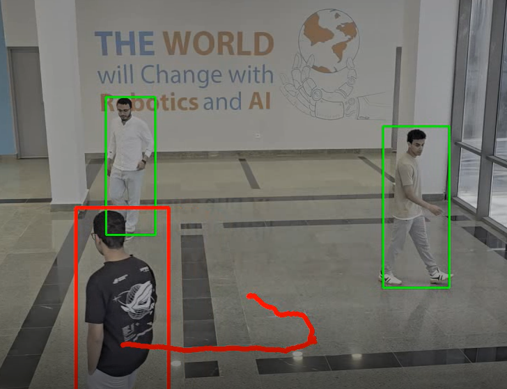

# Person Tracker 👥

[](https://www.python.org/downloads/)
[](https://opencv.org/)
[](https://github.com/ultralytics/ultralytics)
[](LICENSE)



A comprehensive computer vision project that combines YOLO object detection with SORT (Simple Online and Realtime Tracking) algorithm to track people in videos and visualize their movement paths with elegant trail effects.

## ✨ Features

- **Real-time person detection** using YOLOv12 with high accuracy
- **Multi-person tracking** with SORT algorithm for consistent ID assignment
- **Path visualization** with customizable colors, thickness, and smooth transitions
- **Fade effect option** for more visually appealing trails
- **Configurable tracking parameters** for different scenarios
- **Debug mode** for quick testing and development
- **Support for various video formats** (mp4, avi, mov, etc.)

## 🛠️ Installation

```bash
# Clone the repository
git clone https://github.com/yourusername/person-tracker.git
cd person-tracker

# Install dependencies
pip install -r requirements.txt
```

## 📋 Requirements

- Python 3.8+
- OpenCV 4.8+
- Ultralytics (YOLOv12)
- NumPy 1.24.0+
- SciPy 1.10.0+
- FilterPy 1.4.5 (for SORT algorithm)
- Additional libraries listed in requirements.txt

## 🚀 Usage

### Basic Usage

```bash
# Basic usage with default parameters
python Tracker.py
```

### Using Custom Video

```bash
# Using custom video file
python Tracker.py --input your_video.mp4 --output result.mp4
```

### Customizing Tracking Parameters

```bash
# Customize tracking visual appearance
python Tracker.py --color blue --thickness 8 --fade-effect

# Adjust SORT tracking algorithm parameters
python Tracker.py --min-hits 5 --max-age 20 --iou-threshold 0.4
```

### Command Line Options

| Option | Description | Default |
|--------|-------------|---------|
| `--input` | Input video file path | Mossad.mp4 |
| `--output` | Output video file path | output_tracking.mp4 |
| `--debug` | Run in debug mode (process only 10 seconds) | False |
| `--thickness` | Path line thickness | 5 |
| `--color` | Path color (red, green, blue, yellow, etc.) | red |
| `--model` | YOLO model to use | yolo12n.pt |
| `--min-hits` | Minimum hits for SORT tracker | 3 |
| `--max-age` | Maximum age for SORT tracker (frames) | 30 |
| `--iou-threshold` | IOU threshold for SORT tracker | 0.3 |
| `--fade-effect` | Enable path fade effect | False |

## 🔍 How It Works

The tracking system performs the following steps:

1. **Object Detection**: Uses YOLOv12 to detect people in each video frame
2. **ID Assignment**: Applies SORT algorithm to assign consistent IDs to detected people across frames
3. **Path Recording**: Records the position (center point) of each person in each frame
4. **Path Smoothing**: Applies interpolation for natural-looking paths
5. **Visualization**: Renders the paths with customizable colors and optional fade effects

## 📁 Project Structure

```
person-tracker/
├── Tracker.py          # Main tracking script with all functionality
├── sort/               # SORT tracking algorithm implementation
│   ├── sort.py         # Core SORT algorithm
│   └── data/           # Training and test data for SORT
├── requirements.txt    # Dependencies list
├── yolo12n.pt          # YOLOv12 nano model weights
└── README.md           # Project documentation
```

## 🔧 Advanced Configuration

For advanced users who want to fine-tune the tracking system:

- Modify the SORT parameters (`--min-hits`, `--max-age`, `--iou-threshold`) to balance between tracking stability and responsiveness
- Try different YOLO models based on your performance requirements:
  - `yolo12n.pt` (nano): Fastest but less accurate
  - `yolo12s.pt` (small): Balanced performance
  - `yolo12m.pt` (medium): More accurate but slower
  - `yolo12l.pt` (large): Most accurate, requires more computing power

## 📝 License

[MIT License](LICENSE)

## 🙏 Acknowledgments

- [SORT](https://github.com/abewley/sort) - Simple Online and Realtime Tracking algorithm
- [Ultralytics](https://github.com/ultralytics/ultralytics) - YOLOv8 implementation
- [OpenCV](https://opencv.org/) - Open Source Computer Vision Library

## 📊 Performance Considerations

- Processing speed depends on your hardware, especially GPU availability
- For real-time tracking, consider using a smaller YOLO model or reducing input video resolution
- Tracking accuracy can be affected by occlusion, lighting conditions, and camera movement
## 📧 Contact

**Ahmed Mossad** - [ahmed.abdelfattah.mossad@gmail.com](mailto:ahmed.abdelfattah.mossad@gmail.com)

Project Link: [https://github.com/ahmedm0ssad/person-tracker](https://github.com/ahmedm0ssad/person-tracker-sort)
